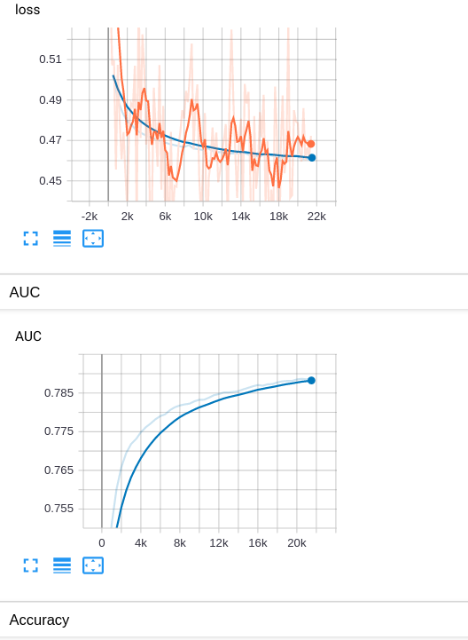
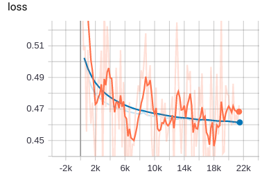
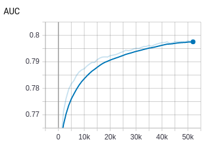
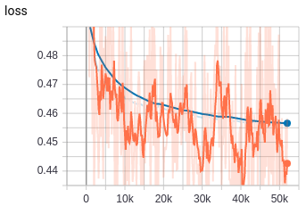
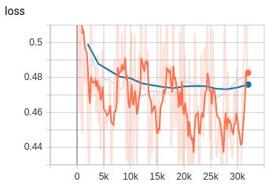
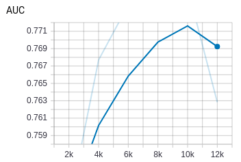
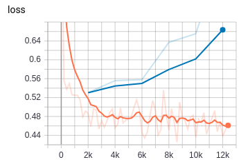

# recsys

## Recsys algorithms, [相关paper目录](https://github.com/wangruichens/papers-machinelearning/tree/master/recsys)。

- deepfm + tf estimator + tf serving + grpc/rest client
- fm
- gbdt + lr
- ftrl (kaggle)
- cade (Collaborative Denoising Auto-Encoder)
- xdeepfm + tf estimator (criteo dataset)
- dcn + tf estimator (criteo dataset)

## Performance Summary

- 都采用criteo dataset 2014, 共39个fields。采用相同的数据预处理。embedding size 都选取16维。

- 主要比较不同算法的区别性。对于共有的dnn part，这里我都采用了100,100的二层结构。

- 都采用256 step size。训练总step 3w左右，不同算法略有不同。有些算法容易过拟合，有些可以多跑几轮，取决于模型复杂程度。

- 虽然没有经过预处理和调参，与实验结果去比较没有什么意义，纯属顺手列在这里，作为参考。

### Deepfm
```angular2
论文结果：  AUC = 0.8007 logloss=0.4508
实验结果：  AUC = 0.7888 logloss=0.4608
平均速度：global_step/sec: 12
```


### xDeepfm
```angular2
论文结果：AUC = 0.8012 logloss = 0.4493
实验结果：AUC = 0.79793376 logloss = 0.45614
平均速度：global_step/sec: 14
```


### DCN (Deep and Cross Network)
```angular2
论文结果：AUC = 0.7961 logloss=0.4508
实验结果：AUC = 0.78843915 logloss =0.46
平均速度：global_step/sec: 45
```

dcn 确实跑的挺快，主要优势在于xT * w 以后得到的是一维标量。计算量会比其他的网络明显小很多。训练速度几乎是deepfm,xdeepfm的3倍~4倍速度。[更多细节看这里](dcn/readme.md)



### DNN
```angular2
论文结果： AUC = 0.7991 logloss=0.4408
实验结果： AUC = 0.7773 logloss=0.6369
平均速度：global_step/sec: 41
```
论文里的那些dnn似乎效果都不错。我这里的raw feature embedding 加上两层100,100的dnn差距很明显。在8k~1w步的时候就开始过拟合了。

没有用爱去调参，区别还是很大的。

也能看出来下面的那些复杂模型的优势，不太需要特征处理，模型即使0调参，效果也不会如此之大。

